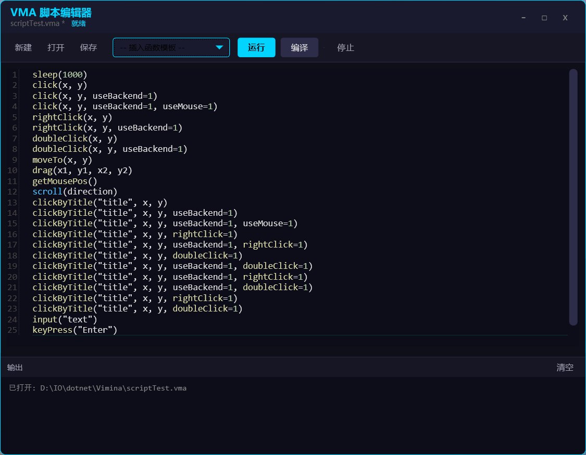

# Vimina

<p align="center">
  
</p>

<p align="center">
  <strong>GUI 文本化 · AI 友好的 Windows 桌面自动化工具</strong>
</p>

<p align="center">
  
  
  
</p>

---

## 简介

Vimina 受浏览器插件 [Vimium](https://github.com/philc/vimium) 启发，是一款将 **GUI 界面文本化** 的 Windows 桌面自动化工具。

通过 UIA3 协议识别窗口控件，将界面元素转换为结构化 JSON 数据，让 AI 助手无需视觉模型即可理解和操作桌面应用。

<p align="center">
  <!-- 使用截图 -->
  
</p>

---

## 为什么选择 Vimina？

### 🤖 AI 友好设计

| 对比项 | 视觉模型方案 | Vimina 方案 |
|--------|-------------|-------------|
| **输入数据** | 截图 (~MB) | JSON 文本 (~KB) |
| **API 成本** | 高 (图片 token) | **极低 (纯文本)** |
| **定位精度** | 像素级猜测 | **控件级精确** |
| **控件属性** | 需视觉推断 | **原生语义信息** |
| **后台操作** | ❌ 不支持 | **✅ 完整支持** |

### 📊 扫描结果示例

```json
{
  "controls": [
    {"label": "A", "type": "Edit", "name": "用户名", "x": 120, "y": 50, "enabled": true},
    {"label": "B", "type": "Edit", "name": "密码", "x": 120, "y": 90, "enabled": true},
    {"label": "C", "type": "Button", "name": "登录", "x": 150, "y": 140, "enabled": true}
  ]
}
```

AI 直接理解界面结构，生成精确操作脚本：

```vma
clickLabel("A")
input("myuser")
clickLabel("B")
input("mypass")
clickLabel("C")
```

### ⚡ 核心优势

- **🎯 精准定位** - 控件级识别，不受分辨率、窗口位置影响
- **👻 后台操作** - 不移动鼠标，不切换窗口，静默执行
- **🔌 HTTP API** - 完整 RESTful 接口，一行代码即可调用
- **📜 VMA 脚本** - 支持变量、循环、函数，可编译为独立 exe
- **💰 零 AI 成本** - 脚本一次生成，无限次复用

---

## 快速开始

### 安装

1. 从 [GitHub Releases](https://github.com/Sunse666/Vimina/releases) 下载最新版本
2. 解压到任意目录
3. 运行 `Vimina.exe`

### 基本用法

| 快捷键 | 功能 |
|--------|------|
| `Alt + F` | 显示/隐藏控件标签 |
| `Alt + R` | 刷新标签 |
| `Esc` | 清除所有标签 |
| `A-Z` | 输入标签字母点击控件 |
| `Backspace` | 删除已输入字符 |

### 操作流程

```
1. 聚焦目标窗口
2. 按 Alt+F 显示标签
3. 输入标签上的字母（如 DJ）
4. 自动点击对应控件
```

<p align="center">
  <!-- 操作演示 GIF -->
  
</p>

### 通过 HTTP API 调用

```bash
# 扫描窗口
curl http://localhost:51401/api/scan

# 点击标签
curl -X POST http://localhost:51401/api/click -d '{"label":"DJ"}'

# 坐标点击
curl http://localhost:51401/api/click/500/300

# 后台点击（不移动鼠标）
curl "http://localhost:51401/api/click/500/300?useBackend=1"
```

### VMA 脚本示例

```vma
// 自动化脚本示例
activate("记事本")
scan()
clickLabel("A")
input("Hello World")
keyPress("Ctrl+S")
```

---

## 与 AI 集成

### Python 示例

```python
import requests

# 扫描窗口，获取结构化数据
result = requests.get("http://localhost:51401/api/scanAll").json()

# AI 分析界面内容，决策后执行
requests.post("http://localhost:51401/api/click", json={"label": "A"})
requests.post("http://localhost:51401/api/input", json={"text": "Hello"})
```

### AI 工作流程

```
┌─────────────┐     scan()     ┌─────────────┐    理解+决策    ┌─────────────┐
│   GUI 界面   │ ─────────────▶ │  结构化JSON  │ ─────────────▶ │   AI 助手   │
└─────────────┘                └─────────────┘                └─────────────┘
                                                                     │
                                     ┌───────────────────────────────┘
                                     ▼
                              ┌─────────────┐
                              │  精确执行    │
                              │ clickLabel  │
                              └─────────────┘
```

---

## 截图预览

<p align="center">
  
  
</p>

<p align="center">
  
  
</p>

---

## 文档与资源

### 📖 完整文档

| 文档 | 说明 |
|------|------|
| [快速开始](https://sunse666.github.io/Vimina-docs/getting-started/) | 安装和基本操作 |
| [基本使用](https://sunse666.github.io/Vimina-docs/basics/) | 标签系统、快捷键 |
| [HTTP API](https://sunse666.github.io/Vimina-docs/api/) | 完整 API 端点和调用示例 |
| [VMA 脚本](https://sunse666.github.io/Vimina-docs/vma/) | 脚本语法、函数、示例 |
| [配置说明](https://sunse666.github.io/Vimina-docs/config/) | 标签样式、点击模式等 |

### 📊 详细对比

| 对比文档 | 说明 |
|----------|------|
| [vs 按键精灵](https://sunse666.github.io/Vimina-docs/vs-anjian/) | 与按键精灵的功能对比 |
| [vs OpenClaw](https://sunse666.github.io/Vimina-docs/vs-openclaw/) | 与 OpenClaw 的技术路线对比 |
| [vs Codex Computer Use](https://sunse666.github.io/Vimina-docs/vs-codex/) | 与 AI 视觉方案的对比 |
| [综合对比](https://sunse666.github.io/Vimina-docs/compare/) | 所有方案的完整对比 |

### 🔗 其他资源

| 资源 | 链接 |
|------|------|
| 📥 **下载最新版** | [GitHub Releases](https://github.com/Sunse666/Vimina/releases) |
| 💻 **源代码** | [GitHub Repository](https://github.com/Sunse666/Vimina) |
| 🐛 **问题反馈** | [GitHub Issues](https://github.com/Sunse666/Vimina/issues) |

---

## 系统要求

- **操作系统**: Windows 10 / 11
- **运行时**: 
  - 小体积版: 需要安装 [.NET 8 Desktop Runtime](https://dotnet.microsoft.com/download/dotnet/8.0)
  - 自包含版: 无需安装任何运行时
- **安装**: 解压即用，无需安装

## 下载

| 版本 | 大小 | 说明 |
|------|------|------|
| **小体积版** | ~3 MB | 需要安装 .NET 8 Runtime |
| **自包含版** | ~180 MB | 无需安装任何依赖，开箱即用 |

从 [GitHub Releases](https://github.com/Sunse666/Vimina/releases) 下载适合你的版本。

---

## 对比其他方案

| 特性 | Vimina | 按键精灵 | OpenClaw | Codex Computer Use |
|------|--------|----------|----------|-------------------|
| 控件识别 | ✅ UIA3 | ❌ 无 | ⚠️ Skills | 视觉识别 |
| 后台操作 | ✅ 完整 | ⚠️ 部分 | ⚠️ 依赖配置 | ❌ |
| HTTP API | ✅ | ❌ | ✅ | ✅ |
| AI 集成 | ✅ 低成本 | ❌ | ✅ 高成本 | 高成本 |
| 浏览器支持 | ⚠️ UIA | ❌ | ✅ Playwright | ✅ |
| 开源免费 | ✅ MIT | ❌ 商业 | ✅ MIT | ❌ |

详细对比: [Vimina vs 其他工具](https://sunse666.github.io/Vimina-docs/compare/)

---

## License

[GPL License](LICENSE)

---

<p align="center">
  Made with 💚 by <a href="https://github.com/Sunse666">Sunse666</a>
</p>
