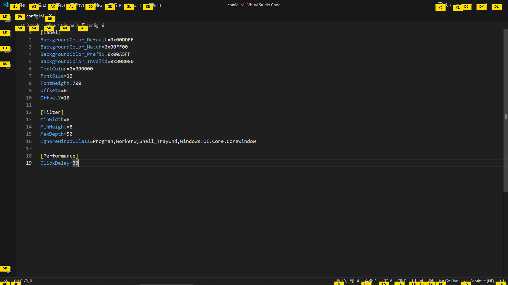
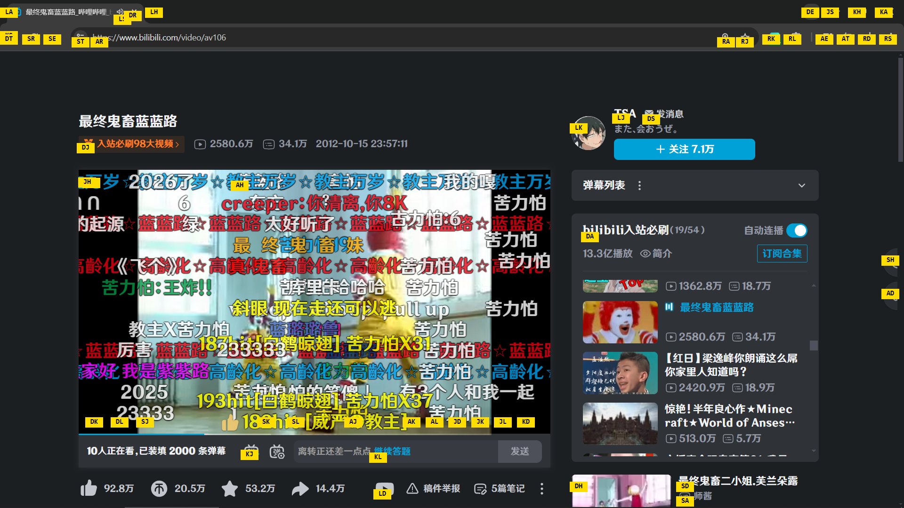
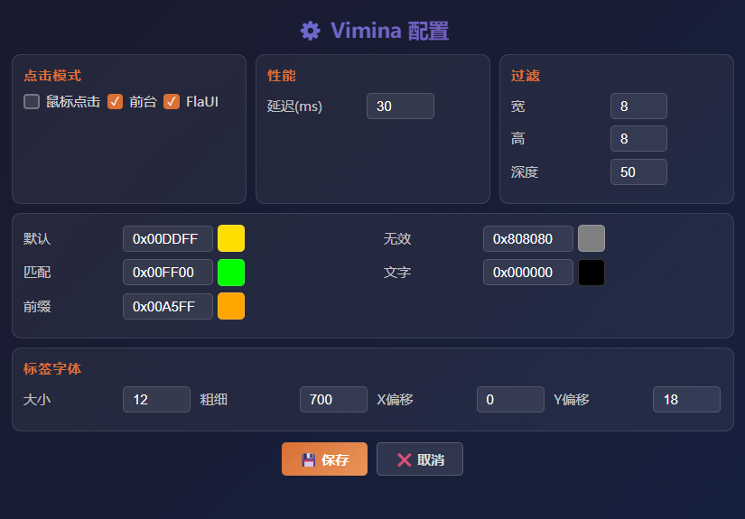

# Vimina
<p align="center">  </p><p align="center"> <strong>用键盘来操作窗口应用</strong> </p><p align="center">    </p>


## ✨ 简介
受浏览器插件 Vimium 启发，在 Windows 上复刻功能的软件。通过 FlaUI 自动化框架识别窗口中的可交互控件，为每个控件生成唯一的字母标签，只需敲击键盘即可精准点击任意按钮、链接、输入框，同时提供 HTTP API 接口，支持外部程序调用，可轻松与 AI 助手、自动化脚本集成,因此彻底解放鼠标，让键盘党的效率飞升。


## 🖼️ 截图

### 使用截图

<p align="center">  </p>

<p align="center">  </p>

### 配置界面

<p align="center">  </p>


## 🚀 功能特性

### 🏷️ 智能标签系统
- 自动识别窗口中的可交互控件
- 为每个控件生成易于输入的双字母标签
- 标签位置智能偏移，避免遮挡控件

### 🎨 实时视觉反馈
- 黄色—默认状态，等待输入
- 橙色—前缀匹配，继续输入
- 绿色—完全匹配，即将点击
- 灰色—无效标签，已过滤

### ⌨️ 快捷键操作

> [!TIP]
> |快捷键|功能|
> |---|---|
> |Alt + F|显示 / 隐藏标签|
> |Alt + R|刷新标签|
> |Esc|清除所有标签|
> |A-Z|输入标签字母|
> |Backspace|删除已输入字符|

### 🎯 支持的控件类型
- Button、CheckBox、RadioButton
- ComboBox、Edit、Slider、Spinner
- Hyperlink、MenuItem、ListItem
- TabItem、TreeItem、ToolBar
- DataItem、SplitButton

### 📌 系统托盘
- 启动后自动最小化到托盘
- 左键点击显示主窗口
- 右键菜单快速访问配置和脚本功能

### 🌐 HTTP API 服务
- 内置轻量 HTTP 服务器，默认端口 51401
- 提供完整的 RESTful 接口
- 支持控件扫描、标签点击、坐标操作、文本输入
- 返回 JSON 格式数据，便于 AI 分析和程序调用
- 支持 CORS 跨域访问

### 📜 VMA 脚本支持
- 支持编写自动化脚本文件(.vma)
- 可通过右键菜单导入并执行脚本
- 支持将脚本编译成独立可执行文件(.exe)
- 内置丰富的脚本命令，包括：
  - 延时、鼠标点击、键盘操作
  - 窗口管理、控件扫描
  - 条件判断、循环控制
  - 变量赋值、日志输出

### 📝 脚本编辑器
- 右键菜单选择「脚本」或点击主窗口「脚本」按钮打开
- 内置 VMA 脚本编写环境，支持代码高亮
- 支持新建、打开、保存脚本文件(.vma)
- **获取位置**按钮：点击后移动鼠标自动获取坐标并插入代码
- 支持一键运行脚本
- 内置命令提示下拉框，支持自动补全
- **编译功能**：可将脚本编译成独立的 .exe 文件，无需安装任何环境即可运行

### 🔒 后台操作支持
- 支持不移动鼠标完成点击操作
- 支持不切换窗口焦点操作后台窗口
- 通过窗口标题即可扫描和点击控件
- 可获取所有窗口列表，排除系统应用


## 🌐 HTTP API

Vimina 内置 HTTP 服务器，启动后自动运行在 `http://localhost:51401`

### 接口总览

| 方法 | 端点 | 说明 |
|------|------|------|
| GET | `/api` | API 信息与帮助 |
| GET | `/api/scan` | 获取扫描结果 |
| POST | `/api/show` | 显示标签并扫描 |
| POST | `/api/hide` | 隐藏标签 |
| POST | `/api/click` | 通过标签点击控件 |
| POST | `/api/click?right=1` | 标签右键点击 |
| POST | `/api/click?double=1` | 标签双击 |
| GET | `/api/click/{x}/{y}` | 坐标点击 |
| GET | `/api/click/{x}/{y}?useBackend=1` | 坐标后台点击 |
| GET | `/api/clickR/{x}/{y}` | 坐标右键点击 |
| GET | `/api/clickR/{x}/{y}?useBackend=1` | 坐标后台右键点击 |
| GET | `/api/dblclick/{x}/{y}` | 坐标双击 |
| GET | `/api/dblclick/{x}/{y}?useBackend=1` | 坐标后台双击 |
| GET | `/api/clickAt?x=&y=&useBackend=1` | 坐标点击(支持后台) |
| POST | `/api/clickAt` | 坐标点击(支持后台) |
| GET | `/api/windows` | 获取所有窗口列表 |
| GET | `/api/scanByTitle?title=xxx` | 通过窗口标题扫描控件 |
| POST | `/api/scanByTitle` | 通过窗口标题扫描控件 |
| GET | `/api/clickByTitle?title=xxx&x=&y=` | 通过窗口标题点击控件(支持后台) |
| POST | `/api/clickByTitle` | 通过窗口标题点击控件(支持后台) |
| GET | `/api/activate?title=xxx` | 激活窗口(切换到前台) |
| GET | `/api/mouse` | 获取鼠标当前位置 |
| GET | `/api/move/{x}/{y}` | 移动鼠标 |
| GET | `/api/drag/{x1}/{y1}/{x2}/{y2}` | 拖拽操作 |
| POST | `/api/input` | 模拟键盘输入文本 |
| GET | `/api/status` | 获取服务状态 |
| POST | `/api/vma/run` | 运行 VMA 脚本 |
| POST | `/api/vma/runFile` | 运行 VMA 脚本文件 |
| GET | `/api/vma/status` | 获取 VMA 脚本运行状态 |
| POST | `/api/vma/stop` | 停止正在运行的 VMA 脚本 |
| GET | `/api/raw/scan` | 获取原始扫描结果 JSON |
| GET | `/api/raw/labels` | 获取原始标签映射 JSON |

### 接口详情

#### 扫描控件

```bash
# 触发扫描并显示标签
curl -X POST http://localhost:51401/api/show

# 获取扫描结果
curl http://localhost:51401/api/scan
```

响应示例:

```JSON
{
  "success": true,
  "timestamp": "...",
  "summary": {
    "totalControls": 15,
    "description": "窗口「记事本」共有 15 个可交互控件"
  },
  "quickReference": [
    "DJ: 文件 (MenuItem)",
    "DK: 编辑 (MenuItem)",
    "DL: 保存 (Button)"
  ],
  "controls": [...]
}
```

### 点击控件

```bash
# 通过标签点击
curl -X POST http://localhost:51401/api/click \
  -H "Content-Type: application/json" \
  -d '{"label": "DJ"}'

# 标签右键点击
curl -X POST http://localhost:51401/api/click \
  -H "Content-Type: application/json" \
  -d '{"label": "DJ", "right": true}'

# 标签双击
curl -X POST http://localhost:51401/api/click \
  -H "Content-Type: application/json" \
  -d '{"label": "DJ", "double": true}'

# 通过坐标点击
curl http://localhost:51401/api/click/500/300

# 坐标后台点击
curl "http://localhost:51401/api/click/500/300?useBackend=1"

# 坐标右键点击
curl http://localhost:51401/api/clickR/500/300

# 坐标后台右键点击
curl "http://localhost:51401/api/clickR/500/300?useBackend=1"

# 坐标双击
curl http://localhost:51401/api/dblclick/500/300

# 坐标后台双击
curl "http://localhost:51401/api/dblclick/500/300?useBackend=1"

# 灵活的坐标点击（支持后台）
curl "http://localhost:51401/api/clickAt?x=500&y=300&useBackend=1"

# POST 方式点击
curl -X POST http://localhost:51401/api/clickAt \
  -H "Content-Type: application/json" \
  -d '{"x": 500, "y": 300, "useBackend": true, "right": false, "double": false}'
```

### 窗口管理

```bash
# 激活窗口（切换到前台）
curl "http://localhost:51401/api/activate?title=记事本"

# 获取所有窗口列表
curl http://localhost:51401/api/windows
```

响应示例：

```JSON
{
  "success": true,
  "count": 5,
  "windows": [
    {"hwnd": 123456, "title": "记事本", "className": "Notepad", "processId": 1234},
    {"hwnd": 789012, "title": "bilibili", "className": "Chrome_WidgetWin_1", "processId": 5678}
  ]
}
```

```bash
# 通过窗口标题扫描控件，支持部分匹配
curl "http://localhost:51401/api/scanByTitle?title=记事本"

# POST 方式扫描
curl -X POST http://localhost:51401/api/scanByTitle \
  -H "Content-Type: application/json" \
  -d '{"title": "记事本"}'
```

```bash
# 通过窗口标题点击控件
curl "http://localhost:51401/api/clickByTitle?title=记事本&x=500&y=300"

# 点击并切换到前台
curl "http://127.0.0.1:51401/api/clickByTitle?title=记事本&x=500&y=300&bringtofront=1&usebackend=0"

# POST 方式点击
curl -X POST http://localhost:51401/api/clickByTitle \
  -H "Content-Type: application/json" \
  -d '{"title": "记事本", "x": 500, "y": 300, "useBackend": true, "bringToFront": false}'
```

> [!TIP]
> 后台点击功能可以在不干扰当前工作的情况下操作其他窗口，非常适合自动化脚本和 AI 助手集成

### 鼠标操作

```bash
# 获取鼠标位置
curl http://localhost:51401/api/mouse

# 移动鼠标
curl http://localhost:51401/api/move/500/300

# 拖拽（从 100,100 拖到 500,300）
curl http://localhost:51401/api/drag/100/100/500/300
```

### 文本输入

```bash
curl -X POST http://localhost:51401/api/input \
  -H "Content-Type: application/json" \
  -d '{"text": "Hello World"}'
```

### 状态查询

```bash
curl http://localhost:51401/api/status
```

响应示例：

```JSON
{
  "running": true,
  "hasData": true,
  "lastScan": "...",
  "mousePosition": {"x": 500, "y": 300},
  "screen": [1920, 1080]
}
```

### VMA 脚本 API

```bash
# 运行 VMA 脚本内容
curl -X POST http://localhost:51401/api/vma/run \
  -H "Content-Type: application/json" \
  -d '{"script": "click(500, 300)\nsleep(1000)\nlog(\"完成\")"}'

# 运行 VMA 脚本文件
curl -X POST http://localhost:51401/api/vma/runFile \
  -H "Content-Type: application/json" \
  -d '{"file": "C:\\path\\to\\script.vma"}'
```

响应示例：

```JSON
{
  "success": true,
  "log": ["完成"],
  "linesExecuted": 3
}
```

#### VMA 脚本控制

```bash
# 获取脚本运行状态
curl http://localhost:51401/api/vma/status
```

响应示例：

```JSON
{
  "running": true,
  "paused": false,
  "currentLine": 15,
  "totalLines": 30,
  "variables": {"x": 10, "y": 20}
}
```

```bash
# 停止正在运行的脚本
curl -X POST http://localhost:51401/api/vma/stop
```

#### 原始数据接口

```bash
# 获取原始扫描结果
curl http://localhost:51401/api/raw/scan

# 获取原始标签映射
curl http://localhost:51401/api/raw/labels
```

### 与 AI 集成

Vimina 的 API 设计对 AI 友好，扫描结果包含丰富的语义信息：

```Python
# Python 示例：让 AI 操作桌面应用
import requests

# 1. 扫描当前窗口(也可事先手动扫描)
requests.post("http://localhost:51401/api/show")

# 2. 获取控件信息供 AI 分析
result = requests.get("http://localhost:51401/api/scan").json()
print(result["quickReference"])
# ['DJ: 文件 (MenuItem)', 'DK: 编辑 (MenuItem)', ...]

# 3. AI 决策后点击目标控件(注意当前前台窗口)
requests.post("http://localhost:51401/api/click", json={"label": "DJ"})
```

### 📜 VMA 脚本

Vimina 支持编写自动化脚本文件(.vma)，可以通过右键菜单导入并执行脚本。

#### 使用方法

**方法一：通过脚本编辑器**
1. 右键菜单选择「脚本」或点击主窗口「脚本」按钮
2. 在编辑器中编写脚本
3. 点击「运行」按钮执行脚本
4. 点击「编译」按钮可将脚本编译成独立的 .exe 文件

**方法二：通过右键菜单导入**
1. 在 Vimina 窗口内右键点击
2. 选择「导入VMA脚本」
3. 选择 .vma 文件即可运行

**方法三：通过 API 调用**
```bash
# 运行脚本内容
curl -X POST http://localhost:51401/api/vma/run \
  -H "Content-Type: application/json" \
  -d '{"script": "click(500,300)\nsleep(1000)"}'

# 运行脚本文件
curl -X POST http://localhost:51401/api/vma/runFile \
  -H "Content-Type: application/json" \
  -d '{"file": "C:\\path\\to\\script.vma"}'
```

#### 编译脚本

Vimina 支持将 VMA 脚本编译成独立的可执行文件：

1. 下载 vma_runtime.exe 放在 Vimina.exe同一目录下
2. 在脚本编辑器中编写脚本
3. 点击「编译」按钮
4. 选择输出路径和文件名
5. 生成的 .exe 文件可以发送给其他人直接运行，无需安装 Vimina 或任何其他环境

> [!TIP]
> 编译后的程序包含完整的 VMA 运行时，支持所有脚本命令，包括后台点击、窗口操作等功能

#### 脚本命令

##### 延时

```vma
sleep(1000)  # 延时 1000 毫秒
```

##### 鼠标操作

```vma
click(500, 300)                    # 左键点击
click(500, 300, useBackend=1)     # 后台左键点击
rightClick(600, 400)               # 右键点击
rightClick(600, 400, useBackend=1) # 后台右键点击
doubleClick(100, 100)              # 双击
doubleClick(100, 100, useBackend=1) # 后台双击
drag(100, 100, 500, 500)           # 拖拽
moveTo(300, 300)                   # 移动鼠标
```

##### 窗口操作

```vma
clickByTitle("记事本", 100, 200)                    # 通过标题点击
clickByTitle("记事本", 100, 200, useBackend=1)     # 后台点击
clickByTitle("记事本", 100, 200, useBackend=0, bringToFront=1) # 点击并激活到前台
activate("记事本")                                    # 激活窗口到前台
var hwnd = findWindow("记事本")                       # 查找窗口
closeWindow("记事本")                                 # 关闭窗口
minimizeWindow("记事本")                              # 最小化窗口
maximizeWindow("记事本")                              # 最大化窗口
restoreWindow("记事本")                               # 恢复窗口
```

##### 键盘操作

```vma
input("Hello World")    # 输入文本
keyPress("Ctrl+A")      # 模拟按键
keyPress("Alt+F4")      # 模拟按键
keyDown("Alt")          # 按下键
keyUp("Alt")            # 抬起键
```

##### 控件扫描

```vma
scan()                  # 扫描前台窗口
scanWindow("记事本")    # 通过标题扫描
clickLabel("按钮")     # 点击标签
show()                 # 显示标签
hide()                 # 隐藏标签
```

##### 等待

```vma
waitFor("新窗口")              # 等待窗口出现 (默认30秒超时)
waitFor("新窗口", timeout=60) # 等待窗口出现 (自定义超时60秒)
```

##### 获取信息

```vma
var pos = getMousePos()      # 获取鼠标位置
var size = getScreenSize()   # 获取屏幕尺寸
var windows = getWindows()   # 获取窗口列表
var result = getLastScanResult() # 获取扫描结果
var labels = getLabels()     # 获取标签
var num = rand(1, 100)       # 生成随机数
```

##### 其他

```vma
screenshot()                # 截图
log("脚本执行中...")        # 日志输出
msg("提示信息")             # 消息提示 (记录到日志)
```

##### 控制流

```vma
// 变量赋值
var count = 10
var name = "Vimina"
var flag = true

// 条件判断
if windowexists("记事本")
    log("记事本窗口存在")
end

// 条件判断 (带 else)
if windowexists("记事本")
    log("窗口存在")
else
    log("窗口不存在")
end

// 多条件判断
if x > 10 and y < 20
    log("条件满足")
end

if x > 10 or y < 5
    log("任一条件满足")
end

// 循环执行
loop(3)
    click(100, 100)
    sleep(200)
endloop

// for 循环
for i = 1 to 10
    log(i)
end

// for 循环 (带步长)
for i = 0 to 100 step 10
    log(i)
end

// while 循环
var x = 0
while x < 10
    x = x + 1
    log(x)
end

// foreach 循环
array items = [1, 2, 3, 4, 5]
foreach item in items
    log(item)
end

// 跳转控制
break       // 跳出循环
continue    // 跳过本次循环

// 标签跳转
startLabel:
log("执行中...")
goto startLabel  // 跳转到标签
```

##### 数组操作

```vma
// 定义数组
array myArr = [1, 2, 3, 4, 5]
array names = ["Alice", "Bob", "Charlie"]

// 数组操作
push(myArr, 6)           // 追加元素到末尾
pop(myArr)               // 弹出末尾元素
shift(myArr)             // 移除首元素
unshift(myArr, 0)        // 在开头插入元素

// 访问数组元素
var first = myArr[1]     // 获取第一个元素
myArr[2] = 100           // 设置元素值

// 获取数组长度
var len = length(myArr)
```

##### 函数定义

```vma
// 定义函数
function add(a, b)
    return a + b
endfunction

// 调用函数
var result = add(10, 20)
log(result)  // 输出: 30

// 带条件返回的函数
function max(a, b)
    if a > b
        return a
    end
    return b
endfunction
```

##### 数学函数

```vma
var a = abs(-5)        // 绝对值 → 5
var b = floor(3.7)     // 向下取整 → 3
var c = ceil(3.2)      // 向上取整 → 4
var d = min(1, 5, 3)   // 最小值 → 1
var e = max(1, 5, 3)   // 最大值 → 5
var f = toInt("123")   // 转整数 → 123
var g = toString(123)  // 转字符串 → "123"
var h = rand(1, 100)   // 随机数 1-100
```

##### 类型判断

```vma
var x = 10
var arr = [1, 2, 3]

// 检查类型
var t = type(x)           // "number"
var isArr = isArray(arr)  // true

// 检查窗口状态
var exists = windowExists("记事本")      // 窗口是否存在
var active = windowActive("记事本")      // 窗口是否激活

// 获取长度
var len = length(arr)      // 数组长度
var strLen = length("hello") // 字符串长度
```

#### 示例脚本

```vma
// Vimina 自动化脚本示例

// 基础操作
sleep(1000)
click(500, 300)

// 窗口操作
activate("记事本")
clickByTitle("记事本", 100, 200)

// 键盘操作
input("Hello World")
keyPress("Ctrl+A")

// 等待窗口
waitFor("新窗口", timeout=30)

// 条件判断
if windowexists("记事本")
    log("记事本窗口存在")
end

// 循环示例
loop(5)
    click(100, 100)
    sleep(500)
endloop

// for 循环示例
for i = 1 to 10
    log("第 " ++ i ++ " 次")
    sleep(100)
end

// 数组操作示例
array positions = [100, 200, 300, 400, 500]
foreach x in positions
    click(x, 300)
    sleep(200)
end

// 函数定义示例
function clickAndWait(x, y, delay)
    click(x, y)
    sleep(delay)
    log("已点击 (" ++ x ++ ", " ++ y ++ ")")
endfunction

clickAndWait(500, 300, 1000)

// 复杂自动化示例
// 批量点击多个位置
array targets = [
    {x: 100, y: 200},
    {x: 300, y: 400},
    {x: 500, y: 600}
]

foreach target in targets
    click(target.x, target.y)
    sleep(300)
end

log("自动化脚本执行完成!")
```

> [!TIP]
> 扫描结果中的 quickReference 字段提供简洁的控件描述，适合作为 AI 的上下文输入


## 📦 安装与使用

### 系统要求
- 操作系统：Windows 10 / 11
- 运行时：.NET Framework 4.6.2+

### 快速开始

1. 从 Releases 页面下载最新版本
2. 解压到任意目录
3. 运行 Vimina.exe
4. 打开任意应用窗口，按下 Alt + F

### 操作流程

1. 聚焦目标窗口
2. Alt+F 显示标签
3. 按下标签上的字母
4. 自动点击对应控件

### 目录结构

```
Vimina/
├── Vimina.exe                # 主程序
├── config.json               # 配置文件
└── data/                    # 数据目录
    ├── scan_result.json     # 扫描结果
    └── label_map.json       # 标签映射
```


## ⚙️ 配置说明

配置文件为程序目录下的 `config.json`，使用 JSON 格式。可以通过主界面按钮或直接编辑文件来修改配置。

### 标签样式

```json
{
    "BackgroundColor_Default": "0x00DDFF",
    "BackgroundColor_Match": "0x00FF00",
    "BackgroundColor_Prefix": "0x00A5FF",
    "BackgroundColor_Invalid": "0x808080",
    "TextColor": "0x000000",
    "FontSize": 12,
    "FontWeight": 700,
    "OffsetX": 0,
    "OffsetY": 18
}
```

| 字段 | 说明 |
|------|------|
| BackgroundColor_Default | 默认背景色 |
| BackgroundColor_Match | 完全匹配时 |
| BackgroundColor_Prefix | 前缀匹配时 |
| BackgroundColor_Invalid | 无效标签 |
| TextColor | 文字颜色 |
| FontSize | 字体大小 |
| FontWeight | 字体粗细 |
| OffsetX | 标签 X 轴偏移 |
| OffsetY | 标签 Y 轴偏移 |

### 过滤设置

```json
{
    "MinWidth": 8,
    "MinHeight": 8,
    "MaxDepth": 50
}
```

| 字段 | 说明 |
|------|------|
| MinWidth / MinHeight | 过滤掉过小的控件，避免标签过于密集 |
| MaxDepth | 限制控件树遍历深度，防止扫描过慢 |

### 点击模式

```json
{
    "UseMouseClick": false,
    "BringToFront": true,
    "UseFlaUIClick": true
}
```

| 字段 | 说明 |
|------|------|
| UseMouseClick | true=使用鼠标移动并点击，false=使用后台点击 |
| BringToFront | true=点击前将窗口移到前台，false=保持窗口在后台 |
| UseFlaUIClick | true=使用 FlaUI 框架进行后台点击，false=使用 winex 点击 |

> [!TIP]
> 后台点击模式（UseMouseClick=false）可以在不移动鼠标、不切换窗口的情况下完成点击操作

### 性能相关

```json
{
    "ClickDelay": 30
}
```

| 字段 | 说明 |
|------|------|
| ClickDelay | 点击后延迟 |

> [!NOTE]
> 如果点击不稳定或目标应用响应慢，可适当增加 ClickDelay 值


## 📋 配置示例

### 默认配置

```json
{
    "UseMouseClick": false,
    "BringToFront": true,
    "UseFlaUIClick": true,
    "ClickDelay": 30,
    "MinWidth": 8,
    "MinHeight": 8,
    "MaxDepth": 50,
    "BackgroundColor_Default": "0x00DDFF",
    "BackgroundColor_Match": "0x00FF00",
    "BackgroundColor_Prefix": "0x00A5FF",
    "BackgroundColor_Invalid": "0x808080",
    "TextColor": "0x000000",
    "FontSize": 12,
    "FontWeight": 700,
    "OffsetX": 0,
    "OffsetY": 18
}
```

### 深色主题配置

```json
{
    "BackgroundColor_Default": "0x3D3D3D",
    "BackgroundColor_Match": "0x00FF00",
    "BackgroundColor_Prefix": "0x00A5FF",
    "BackgroundColor_Invalid": "0x1A1A1A",
    "TextColor": "0xFFFFFF",
    "FontSize": 11,
    "FontWeight": 400,
    "OffsetX": 0,
    "OffsetY": 15
}
```

### 快速扫描

```json
{
    "MinWidth": 15,
    "MinHeight": 15,
    "MaxDepth": 25,
    "ClickDelay": 10
}
```

> [!TIP]
> 减少 MaxDepth 和增大 MinWidth/MinHeight 可显著提升扫描速度

### 纯后台点击模式

```json
{
    "UseMouseClick": false,
    "BringToFront": false,
    "UseFlaUIClick": true,
    "ClickDelay": 30
}
```

> [!TIP]
> 此配置下所有点击操作都在后台完成，不会移动鼠标，不会切换窗口，适合自动化脚本


## 🛠️ 技术特点
- 基于 FlaUI 自动化框架，支持 UIA3 协议
- 智能标签生成算法，优先使用易按的键位组合
- 控件去重机制，相邻 10px 内的控件自动合并
- 全局键盘钩子，不影响其他应用的正常使用
- 单实例运行保护，防止重复启动
- 点击后自动恢复鼠标位置
- 提供图形化配置界面


## ❓ 常见问题

### Q: 按 Alt+F 没有反应？

1. 确保目标窗口在前台且已获得焦点
2. 部分 UWP 应用可能不支持 UIA3 协议

### Q: 标签显示位置不对？

修改配置文件中的偏移值：

```json
{
    "OffsetX": -20,
    "OffsetY": -5
}
```

### Q: 扫描速度太慢？

减少遍历深度和过滤小控件：

```json
{
    "MinWidth": 20,
    "MinHeight": 20,
    "MaxDepth": 30
}
```

### Q: 某些控件识别不到？

- 部分自绘控件可能未正确暴露 UI 自动化接口
- 尝试增加 MaxDepth 值
- 某些控件类型(如 Image、Text)默认不可交互

### Q: 如何在脚本中使用 API？

```bash
# 完整的自动化流程示例
curl -X POST http://localhost:51401/api/show
sleep 1
curl http://localhost:51401/api/scan
curl -X POST http://localhost:51401/api/click -d '{"label":"DJ"}'
curl -X POST http://localhost:51401/api/hide
```

### Q: 如何使用 VMA 脚本？

VMA 脚本是 Vimina 内置的自动化脚本功能，支持编写 .vma 文件来执行自动化任务。

**方法一：通过脚本编辑器**
1. 右键菜单选择「脚本」或点击主窗口「脚本」按钮
2. 在编辑器中编写脚本
3. 点击「运行」执行，或点击「编译」生成独立 .exe 文件

**方法二：通过右键菜单导入**
1. 在 Vimina 窗口内右键点击
2. 选择「导入VMA脚本」
3. 选择 .vma 文件即可运行

**方法三：通过 API 调用**

```bash
# 直接运行脚本内容
curl -X POST http://localhost:51401/api/vma/run \
  -H "Content-Type: application/json" \
  -d '{"script": "click(500,300)\nsleep(1000)"}'

# 运行脚本文件
curl -X POST http://localhost:51401/api/vma/runFile \
  -H "Content-Type: application/json" \
  -d '{"file": "C:\\path\\to\\script.vma"}'
```

### Q: API 支持跨域访问吗？

支持。已配置 CORS 头，可从浏览器中的网页直接调用

### Q: 如何编译脚本？

1. 打开脚本编辑器（右键菜单「脚本」或主窗口「脚本」按钮）
2. 编写或打开脚本文件
3. 点击「编译」按钮
4. 选择输出路径
5. 生成的 .exe 文件可直接运行，无需任何依赖

> [!TIP]
> 编译后的程序包含完整的 VMA 运行时，支持后台点击、窗口操作等所有功能

### Q: 输入按键没反应？

部分控件可能不支持后台点击，改成鼠标点击试试

### Q: 后台右键点击不成功？

尝试先将窗口切换到前台再使用鼠标模式右键点击

### Q: 后台激活浏览器窗口失败？

浏览器窗口有保护机制，不允许通过 API 强行激活到前台，这是 Windows 和浏览器的安全限制。
对于浏览器窗口：

1. 手动点击 切换到浏览器窗口
2. 使用后台点击 浏览器窗口可以在后台正常操作

```bash
# 后台点击浏览器中的按钮
curl -X POST http://localhost:51401/api/clickByTitle \
  -H "Content-Type: application/json" \
  -d '{"title": "Codeforces", "x": 500, "y": 300, "useBackend": true}'
```

实际上对于大多数操作，后台点击(useBackend: true)已经足够了，不需要切换到前台，Vimina 的后台点击功能就是专门为这种情况设计的

> [!TIP]
> 如果一定要切换到前台，这种方法也是可以的(先切换到前台再右键点击)
> ```bash
> curl "http://localhost:51401/api/clickByTitle?title=Codeforces&x=100&y=200&right=1"
> ```

### Q: 与其他相似功能软件对比相比怎么样？

[Codex Computer Use](vsCodex.md) [按键精灵](compare.md)

---
<p align="center"> Made with 💚 by Vimina </p>
